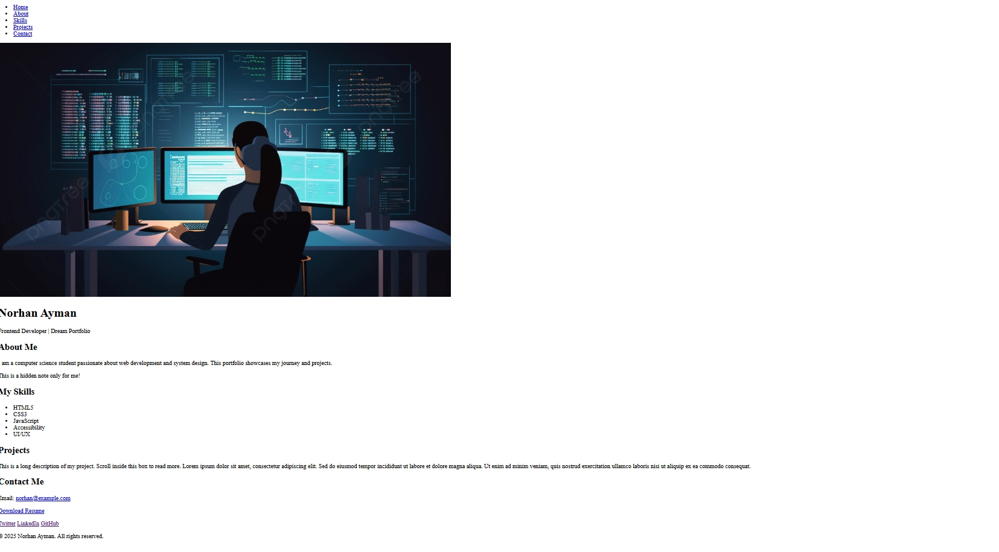

# My Dream Portfolio – CSS Mastery Challenge

This is my personal portfolio built with pure HTML and CSS.  
It demonstrates mastery of CSS basics (Lessons 1–16) including colors, backgrounds, borders, spacing, display, overflow, and more.

---

## 📸 Screenshots
**Before (HTML only):**  

**After (with CSS):**  

---

## ✅ Validation
- W3C Validator: **0 errors, 0 warnings**  
- WAVE Accessibility: **0 errors**

---

## 📁 Project Structure
my-dream-portfolio/ ├── index.html ├── style.css ├── assets/ │ ├── images/ │ │ └── profile.jpg │ └── resume.pdf └── README.md

---

## 🧪 CSS Properties Used
| Property              | Used On             | Example Value          |
|-----------------------|---------------------|------------------------|
| background-color      | Body, sections      | #f5f7fa                |
| background-image      | Hero section        | url('assets/images/bg.jpg') |
| padding               | Sections, cards     | 60px 20px              |
| margin                | Sections spacing    | 30px auto              |
| border                | Profile picture     | 5px solid white        |
| border-radius         | Profile picture     | 50%                    |
| outline               | Nav link focus      | 3px solid orange       |
| width / height        | Project box, image  | 300px / 150px          |
| max-width             | Sections, project   | 900px                  |
| display: block        | Section containers  | block                  |
| display: inline-block | Skills list items   | inline-block           |
| overflow-y            | Project box         | scroll                 |
| visibility: hidden    | Secret note         | hidden                 |
| Grouping selectors    | `.header a, .social a` | color: #333         |
| Clean class names     | `.hero__title`, `.hero__subtitle` | BEM style |

---

## ✨ Bonus Features
- Hover effects on links and buttons  
- Used `outline` instead of `border` for focus state  
- Creative use of `overflow` (scrollable project box)  
- Navigation bar fixed using `position: sticky`

---

## 👩‍💻 Author
**Norhan Ayman**  
Faculty of Computers and Information – Mansoura University  
Frontend Track – MEGA TEAM 2025
